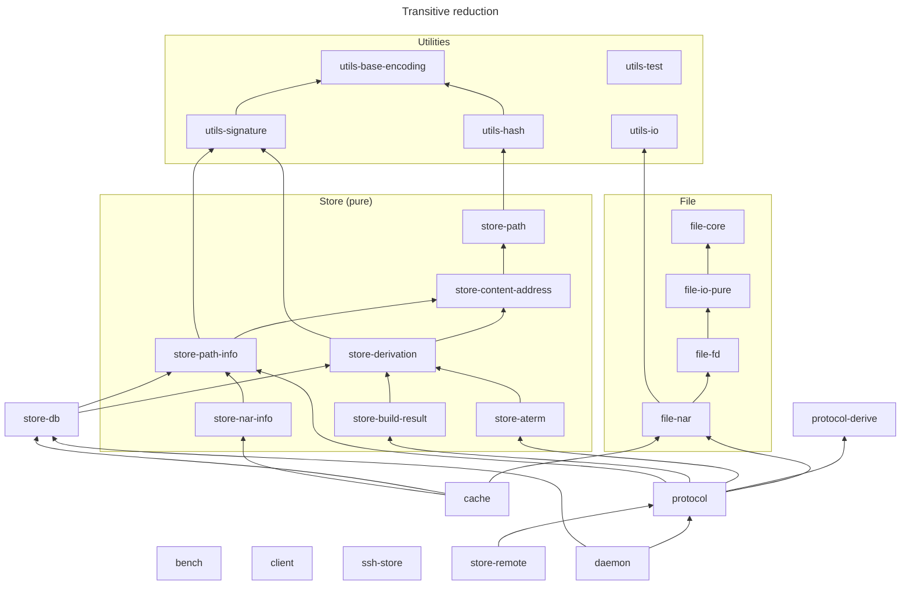

# Harmonia Store Structure

The crate layout follows the [hnix-store](https://github.com/haskell-nix/hnix-store)
layering model: pure store semantics are kept separate from effectful I/O so that
core logic can be tested in isolation and store backends can be swapped or
composed.

## Layers

```
┌──────────────────────────────────────────────────────┐
│  Application                                         │
│  harmonia-cache · harmonia-daemon · harmonia-client  │
└──────────────────────────────────────────────────────┘
                         ↓
┌──────────────────────────────────────────────────────┐
│  Protocol                                            │
│  harmonia-protocol · harmonia-protocol-derive        │
│  wire types, handshake, (de)serialization            │
└──────────────────────────────────────────────────────┘
                         ↓
┌────────────────────────────┬─────────────────────────┐
│  Format / File             │  Database               │
│  harmonia-file-nar         │  harmonia-store-db      │
│  harmonia-file-core/io/fd  │                         │
│  NAR pack/unpack, file I/O │  SQLite store metadata  │
└────────────────────────────┴─────────────────────────┘
                         ↓
┌──────────────────────────────────────────────────────┐
│  Store (pure)                                        │
│  harmonia-store-path · harmonia-store-content-address│
│  harmonia-store-derivation · harmonia-store-aterm    │
│  harmonia-store-path-info · harmonia-store-nar-info  │
│  no I/O, no async                                    │
└──────────────────────────────────────────────────────┘
                         ↓
┌──────────────────────────────────────────────────────┐
│  Utilities (harmonia-utils-*)                        │
│  io · base-encoding · hash · signature · test        │
│  protocol-specific building blocks, not Nix-specific │
└──────────────────────────────────────────────────────┘
```

## Crates

| Crate | Purpose |
|-------|---------|
| [harmonia-store-path](../../harmonia-store-path/README.md) | Store path types, parsing, validation |
| [harmonia-store-content-address](../../harmonia-store-content-address/README.md) | Content addressing and store path computation |
| [harmonia-store-derivation](../../harmonia-store-derivation/README.md) | Derivations, derived paths, realisations (pure) |
| [harmonia-store-aterm](../../harmonia-store-aterm/) | ATerm derivation parser |
| [harmonia-store-path-info](../../harmonia-store-path-info/) | ValidPathInfo types (pure) |
| [harmonia-store-db](../../harmonia-store-db/README.md) | SQLite store metadata |
| [harmonia-file-core](../../harmonia-file-core/) | File tree data types and serde |
| [harmonia-file-io-pure](../../harmonia-file-io-pure/) | Async IO traits, in-memory impls, listing |
| [harmonia-file-fd](../../harmonia-file-fd/) | Filesystem source/sink via cap-tokio |
| [harmonia-file-nar](../../harmonia-file-nar/README.md) | NAR archive format |
| [harmonia-protocol](../../harmonia-protocol/README.md) | Daemon wire protocol |
| [harmonia-protocol-derive](../../harmonia-protocol-derive/README.md) | Derive macros for protocol types |
| [harmonia-daemon](../../harmonia-daemon/README.md) | Store daemon server |
| [harmonia-store-remote](../../harmonia-store-remote/README.md) | Daemon client library |
| [harmonia-ssh-store](../../harmonia-ssh-store/README.md) | Remote store over SSH (stub) |
| [harmonia-client](../../harmonia-client/README.md) | `harmonia` CLI binary (stub) |
| [harmonia-cache](../../harmonia-cache/README.md) | HTTP binary cache server |
| [harmonia-bench](../../harmonia-bench/) | Criterion benchmarks |
| [harmonia-utils-io](../../harmonia-utils-io/README.md) | Async byte streams, wire padding |
| [harmonia-utils-base-encoding](../../harmonia-utils-base-encoding/README.md) | Nix base32, hex, base64 |
| [harmonia-utils-hash](../../harmonia-utils-hash/README.md) | Hash types, algorithms, formatting |
| [harmonia-utils-signature](../../harmonia-utils-signature/) | Ed25519 NAR signatures (no store dep) |
| [harmonia-utils-test](../../harmonia-utils-test/README.md) | Proptest strategies (dev-only) |

The `harmonia-utils-*` crates implement concrete protocols and encodings that
Nix happens to use today (nixbase32, NAR padding, hash algorithms, Ed25519
signatures) but contain no Nix store semantics. They could be reused outside
Nix-related tasks.

## Dependency Graph

<!-- Regenerate with: python3 scripts/dependency-diagram.py --update -->



`harmonia-client`, `harmonia-ssh-store` and `harmonia-bench` currently have no
intra-workspace dependencies.

## Layer Rules

**Utilities** (`harmonia-utils-*`)
- No store semantics; protocol/encoding building blocks only.
- Minimal cross-dependencies between utils crates.
- I/O utils: async-first, bounded buffers, zero-copy where possible.
- Encoding/hash utils: pure, `const` where possible, tested against upstream
  vectors.

**Store (pure)** (`harmonia-store-path`, `harmonia-store-content-address`, `harmonia-store-derivation`, `harmonia-store-aterm`, `harmonia-store-path-info`, `harmonia-store-build-result`, `harmonia-store-nar-info`)
- No I/O, no async, no `tokio`.
- Pure, deterministic functions returning `Result`; no panics.
- Stream-friendly (no unbounded buffers).
- `harmonia-store-path`: fundamental store path types (`StorePath`, `StoreDir`, etc.) — leaf crate with no store-semantic dependencies.
- `harmonia-store-content-address`: `ContentAddress` types and `make_store_path_from_ca` — depends on `harmonia-store-path`.
- `harmonia-store-derivation`: derivations, derived paths, placeholders, realisations — depends on `harmonia-store-content-address`.
- `harmonia-store-aterm`, `harmonia-store-path-info`, `harmonia-store-build-result`, `harmonia-store-nar-info`: format/metadata crates kept separate to avoid coupling.

**File** (`harmonia-file-core`, `harmonia-file-io-pure`, `harmonia-file-fd`, `harmonia-file-nar`)
- `harmonia-file-core`: pure file tree data types (`FileTree`, `FileSystemObject`), serde matching nix's JSON format.
- `harmonia-file-io-pure`: async IO traits (`FileSystemSource`/`FileSystemSink`), in-memory implementations, listing functions.
- `harmonia-file-fd`: real filesystem source/sink via `cap-tokio` (openat, no symlink following).
- `harmonia-file-nar`: NAR pack/unpack against generic `FileSystemSource`/`FileSystemSink` traits. Streaming; never requires the full input in memory. Knows nothing about derivations or signatures.

**Database** (`harmonia-store-db`)
- Schema matches Nix's `db.sqlite` exactly.
- Uses store types for realisations, store paths, etc.
- System database opened read-only/immutable.
- Synchronous API; callers wrap in `spawn_blocking`.
- Tests use `:memory:`.

**Protocol** (`harmonia-protocol`)
- Versioned, backward-compatible with older protocol versions.
- Wire format documented on the types.
- Serialization round-trip tests; no I/O in the protocol types themselves.

**Application** (`daemon`, `client`, `cache`, `ssh-store`)
- Compose lower layers; do not reimplement core logic.
- This is where filesystem/network effects live.
- Structured logging, metrics, integration tests.

## Comparison with hnix-store

| hnix-store | Harmonia |
|------------|----------|
| hnix-store-core | harmonia-store-path + harmonia-store-content-address + harmonia-store-derivation |
| hnix-store-nar | harmonia-file-nar |
| hnix-store-json | harmonia-protocol (JSON serialization for protocol types) |
| hnix-store-remote | harmonia-store-remote / harmonia-client |
| hnix-store-db | harmonia-store-db |
| hnix-store-readonly | (not yet split out) |
| (internal) | harmonia-utils-io / -base-encoding / -hash / -test |

Harmonia additionally ships a daemon server (`harmonia-daemon`); hnix-store is
client-side only.
